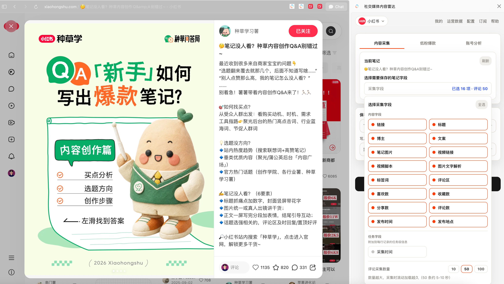

# 社交媒体内容雷达：🍠小红书&抖音内容保存至飞书、obsidian

社交媒体内容雷达是一款面向内容运营者、创作者的浏览器插件，支持在小红书、抖音页面中完成内容采集、低粉爆款挖掘、账号分析和视频脚本提取。

> 本仓库是公开展示仓库，只包含产品介绍、安装说明、隐私政策与公开截图，不包含插件源码、云函数代码或任何密钥。

## 官网与下载

- 官网：[https://smcr.top/](https://smcr.top/)
- 下载安装：[https://smcr.top/download.html](https://smcr.top/download.html)
- 隐私政策：[https://smcr.top/privacy.html](https://smcr.top/privacy.html)
- 使用手册：[飞书文档](https://eqmw9iiyfbw.feishu.cn/docx/ZCXhddvWvoCuVqx5hVvcBnNsnZT)

## 适用人群

- 做小红书、抖音内容运营的人
- 需要建立选题库、素材库、对标库的创作者
- 需要分析账号定位、内容策略和爆款规律的运营者
- 需要把内容数据写入飞书多维表格或 Obsidian 的个人团队

## 核心功能

### 内容采集

在浏览小红书或抖音时，将当前笔记或视频保存为结构化数据。支持字段选择、评论采集、图片保存、视频脚本提取，并可写入本地、飞书多维表格或 Obsidian。

### 低粉爆款挖掘

围绕关键词筛选高互动内容，并辅助识别“粉丝不多但内容表现好”的笔记，用于发现更值得参考的选题和账号。

### 账号分析

对目标账号进行快速分析或深度分析，辅助拆解账号定位、内容策略、商业模式和借鉴建议。

### 视频脚本提取

对小红书或抖音视频进行语音识别，生成可复盘、可沉淀的视频脚本文本。

### 多渠道写入

支持将采集结果写入：

- 电脑本地表格
- 飞书多维表格
- Obsidian 本地仓库

## 产品定位

社交媒体内容雷达是“增效工具”，不是批量爬取工具。它的目标是帮助用户整理自己正在浏览和分析的公开内容，减少重复复制、整理和格式化工作。

## 支持平台

| 平台 | 支持情况 |
| --- | --- |
| 小红书 | 支持 |
| 抖音 | 支持 |
| 飞书多维表格 | 支持写入 |
| Obsidian | 支持本地写入 |

## 安装

请查看 [INSTALL.md](INSTALL.md)，或直接访问官网下载安装页：

[https://smcr.top/download.html](https://smcr.top/download.html)

## 隐私与安全

请查看 [PRIVACY.md](PRIVACY.md) 和 [SECURITY.md](SECURITY.md)。

## 联系

- 微信：`zp877315342`
- 邮箱：`877315342@qq.com`

## 说明

本仓库不接受源码级 Issue 和 Pull Request。若你遇到产品使用问题，请通过官网或微信联系开发者。
